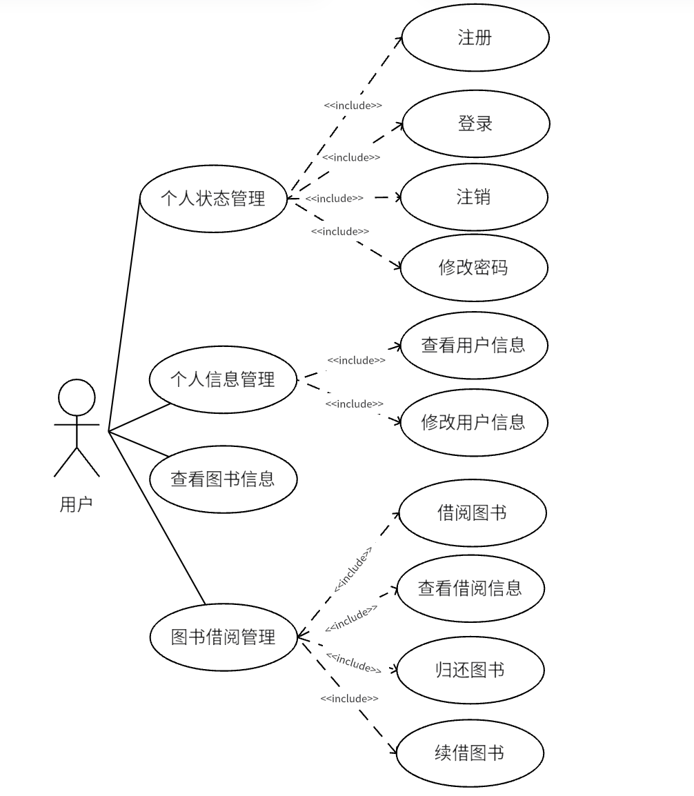
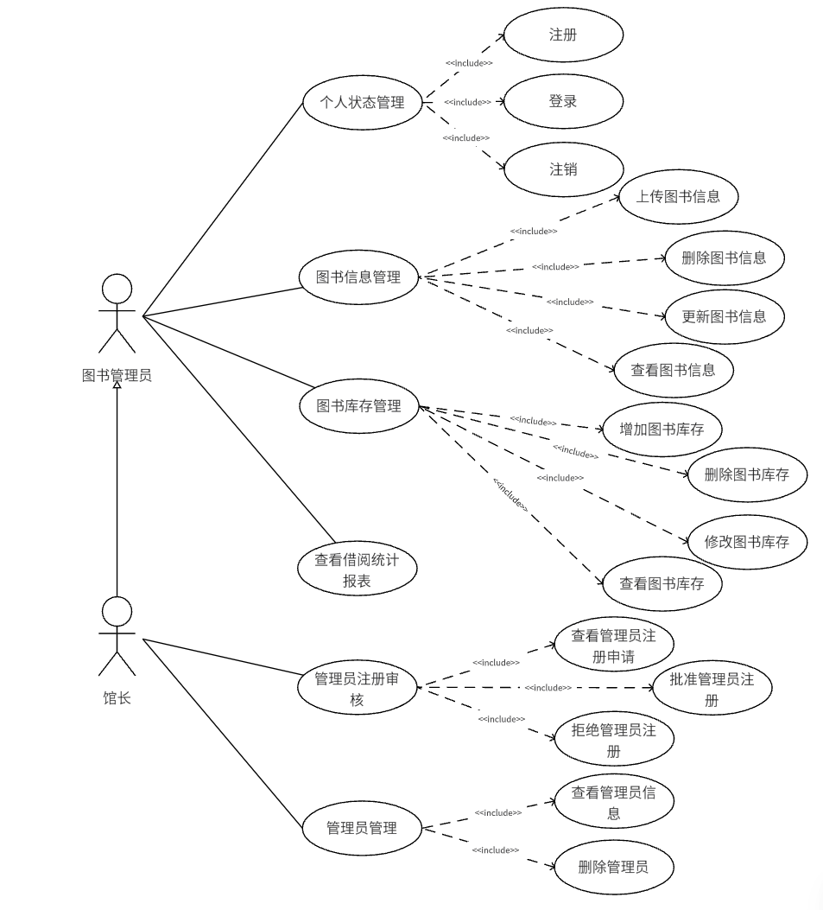

# 需求分析

## 系统角色分析

图书管理系统主要涉及读者用户、图书管理员、馆长三类角色。读者用户可以注册并登录到系统，建立并管理自己的个人信息、查看图书信息、借阅图书；图书管理员则可以在图书管理系统注册自己的账号，管理图书信息、处理图书借阅与归还、查看借阅统计报表；而馆长则在图书管理员的基础上增加了部分功能如：可以管理图书管理员的注册，并且可以查看管理员信息和删除管理员。

## 系统功能性需求分析

招聘网站的用户可分为读者用户、图书管理员与馆长三类角色，按照这三类角色的需求将系统分为读者用户端和后台管理端两个部分。

### 读者用户端

图书管理系统用户端的功能模块如下：

1. **个人状态管理**
   1. **注册**：用户可以通过注册获取到账号来登录到系统。
   2. **登录**：用户可以在输入信息后登录系统进行操作。
   3. **注销**：用户可以登录到系统后在完成操作后安全注销。
   4. **修改密码**：用户可以修改自己的登录密码以保证账户安全。

2. **个人信息管理**
   1. **查看用户信息**：用户可以查看自己的个人信息。
   2. **修改用户信息**：用户可以对自己的个人信息进行修改。

3. **查看图书信息**：用户可以查看图书的详细信息，包括书名、作者、出版社、ISBN号、封面、简介。

4. **图书借阅管理**
   1. **借阅图书**：用户可以在查看图书信息后，借阅存在库存的图书。
   2. **查看图书借阅**：用户可以查看当前借阅的图书列表，包括借阅的书名、借阅日期、应还日期信息。
   3. **归还图书**：用户可以归还图书来更新个人借阅记录。
   4. **续借图书**：对于即将到期的图书，用户若还存在续借次数可以申请续借，延长30天的借阅时间。

求职用户的用例图如下：

下面对用户端的功能模块进行用例描述。

| 用例名称 |              用例描述              | 参与者 | 前置条件 |                     触发条件                     |                  基本操作流程                  | 可选操作流程 |       异常事件       |
| :------: | :--------------------------------: | :----: | :------: | :----------------------------------------------: | :--------------------------------------------: | :----------: | :------------------: |
|   注册   | 用户通过注册获取账号来登录到系统。 |  用户  |    无    | 用户在用户注册页填写完注册表单后，点击注册按钮。 | 1、用户填写注册信息。 2、用户点击注册按钮。 |      无      | 提示该用户名已注册。 |

| 用例名称 |        用例描述        | 参与者 |   前置条件   |                     触发条件                     |                  基本操作流程                  | 可选操作流程 |                   异常事件                   |
| :------: | :--------------------: | :----: | :----------: | :----------------------------------------------: | :--------------------------------------------: | :----------: | :------------------------------------------: |
|   登录   | 用户登录系统进行操作。 |  用户  | 用户注册完成 | 用户在用户登录页填写完登录信息后，点击登录按钮。 | 1、用户填写登录信息。 2、用户点击登录按钮。 |      无      | 1、提示用户不存在。 2、提示用户密码错误。 |

| 用例名称 |       用例描述       | 参与者 |   前置条件   |             触发条件             |      基本操作流程      | 可选操作流程 | 异常事件 |
| :------: | :------------------: | ------ | :----------: | :------------------------------: | :--------------------: | :----------: | :------: |
|   注销   | 用户完成操作后注销。 | 用户   | 登录到系统后 | 用户在用户主页点击退出登录按钮。 | 用户点击退出登录按钮。 |      无      |    无    |

| 用例名称 |       用例描述       | 参与者 |   前置条件   |             触发条件             |                         基本操作流程                         | 可选操作流程 |                           异常事件                           |
| :------: | :------------------: | :----: | :----------: | :------------------------------: | :----------------------------------------------------------: | :----------: | :----------------------------------------------------------: |
| 修改密码 | 用户修改自己的密码。 |  用户  | 登录到系统后 | 用户在用户主页点击修改密码按钮。 | 1、用户点击修改密码的按钮。 2、用户填写旧密码、新密码和确认新密码。 3、用户点击确认按钮修改密码。 |      无      | 1、提示用户密码输入错误。 2、提示用户两次输入密码不一致。 |

|   用例名称   |         用例描述         | 参与者 |   前置条件   |        触发条件        |             基本操作流程             | 可选操作流程 | 异常事件 |
| :----------: | :----------------------: | :----: | :----------: | :--------------------: | :----------------------------------: | :----------: | :------: |
| 查看用户信息 | 用户查看自己的用户信息。 |  用户  | 登录到系统后 | 用户切换到用户信息页。 | 用户点击主页面导航栏的用户信息按钮。 |      无      |    无    |

|   用例名称   |         用例描述         | 参与者 |    前置条件    |               触发条件               |                         基本操作流程                         | 可选操作流程 | 异常事件 |
| :----------: | :----------------------: | :----: | :------------: | :----------------------------------: | :----------------------------------------------------------: | :----------: | :------: |
| 修改用户信息 | 用户修改自己的用户信息。 |  用户  | 进入用户信息页 | 用户在用户信息页，点击修改信息按钮。 | 1、用户点击用户信息页的修改信息按钮。 2、用户填修改写用户信息的表单。 3、用户点击确认按钮修改用户信息。 |      无      |    无    |

|   用例名称   |      用例描述      | 参与者 |    前置条件    |        触发条件        |             基本操作流程             |                  可选操作流程                  | 异常事件 |
| :----------: | :----------------: | :----: | :------------: | :--------------------: | :----------------------------------: | :--------------------------------------------: | :------: |
| 查看图书信息 | 用户查看图书信息。 |  用户  | 进入馆藏数据页 | 用户切换到馆藏数据页。 | 用户点击主页面导航栏的馆藏数据按钮。 | 可以点击下方分页栏，选择分页大小和进入第几页。 |    无    |

| 用例名称 |    用例描述    | 参与者 |             前置条件             |               触发条件               |                         基本操作流程                         | 可选操作流程 |             异常事件             |
| :------: | :------------: | :----: | :------------------------------: | :----------------------------------: | :----------------------------------------------------------: | :----------: | :------------------------------: |
| 借阅图书 | 用户借阅图书。 |  用户  | 进入馆藏数据页，打开图书详细信息 | 用户位于图书详情界面，点击借阅按钮。 | 1、用户点击图书，进入图书详情界面。 2、用户点击借阅图书按钮。 3、用户查看弹出框内容后，点击确认。 |      无      | 提醒用户图书余量不足不允许借阅。 |

|   用例名称   |         用例描述         | 参与者 |    前置条件    |         触发条件         |             基本操作流程             | 可选操作流程 | 异常事件 |
| :----------: | :----------------------: | :----: | :------------: | :----------------------: | :----------------------------------: | :----------: | :------: |
| 查看借阅信息 | 用户查看自己的借阅信息。 |  用户  | 进入我的借阅页 | 用户切换到我的借阅界面。 | 用户点击主页面导航栏的我的借阅按钮。 |      无      |    无    |

| 用例名称 |         用例描述         | 参与者 |    前置条件    |             触发条件             |                         基本操作流程                         | 可选操作流程 | 异常事件 |
| :------: | :----------------------: | :----: | :------------: | :------------------------------: | :----------------------------------------------------------: | :----------: | :------: |
| 归还图书 | 用户归还自己的借阅图书。 |  用户  | 进入我的借阅页 | 用户点击借阅信息后面的归还按钮。 | 1、用户点击借阅信息后面的归还按钮。 2、用户查看弹出框内容后，点击确认。 |      无      |    无    |

| 用例名称 |         用例描述         | 参与者 |    前置条件    |             触发条件             |                         基本操作流程                         | 可选操作流程 |               异常事件               |
| :------: | :----------------------: | :----: | :------------: | :------------------------------: | :----------------------------------------------------------: | :----------: | :----------------------------------: |
| 续借图书 | 用户续借自己的借阅图书。 |  用户  | 进入我的借阅页 | 用户点击借阅信息后面的续借按钮。 | 1、用户点击借阅信息后面的续借按钮。 2、用户查看弹出框内容后，点击确认。 |      无      | 提醒用户图书续借次数不足不允许续借。 |

### 后台管理端

图书管理系统后台管理端的功能模块如下：

1. **个人状态管理**
   1. **登录**：允许已注册的管理员用户通过输入用户名和密码来访问系统。
   2. **注销**：允许管理员用户退出登录状态，结束当前会话。
   3. **注册**：允许新的管理员用户创建账户，需要提供可以证明自己身份的信息（如姓名、身份证号码等），系统将这些信息发送给馆长用以审核。
2. **图书信息管理**
   1. **增加图书信息**：此功能允许管理员添加新的图书记录到系统中，包括书名、作者、出版社、ISBN号、封面、简介。
   2. **删除图书信息**：管理员可以通过此功能从系统中移除不再需要的图书记录。
   3. **更新图书信息**：管理员可以修改现有图书记录的详细信息，以保持图书信息的准确性。
   4. **查看图书信息**：管理员可以查看系统中所有图书的详细信息。
3. **图书库存管理**
   1. **增加图书库存**：管理员可以通过此功能增加图书的库存数量。
   2. **删除图书库存**：当图书不再被图书馆收藏时，管理员可以减少图书的库存。
   3. **修改图书库存**：管理员可以调整图书库存的状态，如书籍位置，是否在架，以反映实际的库存变化。
   4. **查看图书库存**：管理员可以查看当前所有图书的库存情况，包括每本书的状态。
4. **查看借阅统计报表**：提供图书馆中图书借阅情况的统计报表，包括近十天的借阅趋势、书籍借阅排名、借阅排名信息等，帮助管理员了解图书的流行度和借阅趋势。
5. **管理员注册管理**
   1. **查看管理员注册申请**：馆长可以查看所有待审批的管理员注册申请。
   2. **批准管理员注册**：馆长可以批准新的管理员注册申请，允许用户成为系统管理员。
   3. **拒绝管理员注册**：馆长可以拒绝不符合要求的管理员注册申请。
6. **管理员管理**
   1. **查看管理员信息**：馆长可以查看系统中其他管理员的基本信息。
   2. **删除管理员**：馆长可以删除不再需要访问系统的管理员账户。

图书管理员和馆长的用例图如下：

下面对后台管理端的功能模块进行用例描述。

| 用例名称 |               用例描述               | 参与者 | 前置条件 |                       触发条件                       |                    基本操作流程                    | 可选操作流程 | 异常事件 |
| :------: | :----------------------------------: | :----: | :------: | :--------------------------------------------------: | :------------------------------------------------: | :----------: | :------: |
|   注册   | 管理员通过注册获取账号来登录到系统。 | 管理员 |    无    | 管理员在管理员注册页填写完注册表单后，点击注册按钮。 | 1、管理员填写注册信息。 2、管理员点击注册按钮。 |      无      |    无    |

| 用例名称 |         用例描述         | 参与者 |    前置条件    |                       触发条件                       |                    基本操作流程                    | 可选操作流程 |                     异常事件                     |
| :------: | :----------------------: | :----: | :------------: | :--------------------------------------------------: | :------------------------------------------------: | :----------: | :----------------------------------------------: |
|   登录   | 管理员登录系统进行操作。 | 管理员 | 管理员注册完成 | 管理员在管理员登录页填写完登录信息后，点击登录按钮。 | 1、管理员填写登录信息。 2、管理员点击登录按钮。 |      无      | 1、提示管理员不存在。 2、提示管理员密码错误。 |

| 用例名称 |        用例描述        | 参与者 |   前置条件   |               触发条件               |       基本操作流程       | 可选操作流程 | 异常事件 |
| :------: | :--------------------: | ------ | :----------: | :----------------------------------: | :----------------------: | :----------: | :------: |
|   注销   | 管理员完成操作后注销。 | 管理员 | 登录到系统后 | 管理员在管理员主页点击退出登录按钮。 | 管理员点击退出登录按钮。 |      无      |    无    |

|   用例名称   |         用例描述         | 参与者 |      前置条件      |                  触发条件                  |                         基本操作流程                         | 可选操作流程 |         异常事件         |
| :----------: | :----------------------: | :----: | :----------------: | :----------------------------------------: | :----------------------------------------------------------: | :----------: | :----------------------: |
| 增加图书信息 | 管理员增加新的图书信息。 | 管理员 | 进入图书信息管理页 | 管理员在图书信息管理页，点击添加图书按钮。 | 1、管理员添加图书按钮。 2、管理员填写图书信息表单。 3、管理员点击确认按钮。 |      无      | 提示管理员该图书已存在。 |

|   用例名称   |       用例描述       | 参与者 |       前置条件       |                       触发条件                       |                         基本操作流程                         | 可选操作流程 |           异常事件           |
| :----------: | :------------------: | :----: | :------------------: | :--------------------------------------------------: | :----------------------------------------------------------: | :----------: | :--------------------------: |
| 删除图书信息 | 管理员删除图书信息。 | 管理员 | 进入图书信息管理页。 | 管理员在图书信息管理页，点击图书信息的删除信息按钮。 | 1、用户点击删除信息按钮。 2、用户查看弹出框内容后，点击确认。 |      无      | 提示管理员当前图书存在借阅。 |

|   用例名称   |       用例描述       | 参与者 |       前置条件       |                     触发条件                     |                         基本操作流程                         | 可选操作流程 | 异常事件 |
| :----------: | :------------------: | :----: | :------------------: | :----------------------------------------------: | :----------------------------------------------------------: | :----------: | :------: |
| 更新图书信息 | 管理员修改图书信息。 | 管理员 | 进入图书信息管理页。 | 管理员在图书信息管理页，点击图书信息的修改按钮。 | 1、管理员点击修改图书按钮。 2、管理员填写图书信息表单。 3、管理员点击确认按钮。 |      无      |    无    |

|   用例名称   |       用例描述       | 参与者 |           前置条件           |           触发条件           |                基本操作流程                |                  可选操作流程                  | 异常事件 |
| :----------: | :------------------: | :----: | :--------------------------: | :--------------------------: | :----------------------------------------: | :--------------------------------------------: | :------: |
| 查看图书信息 | 管理员查看图书信息。 | 管理员 | 管理员切换到图书信息管理页。 | 管理员切换到图书信息管理页。 | 管理员点击主页面导航栏的图书信息管理按钮。 | 可以点击下方分页栏，选择分页大小和进入第几页。 |    无    |

|   用例名称   |         用例描述         | 参与者 |                   前置条件                   |                           触发条件                           |                         基本操作流程                         | 可选操作流程 | 异常事件 |
| :----------: | :----------------------: | :----: | :------------------------------------------: | :----------------------------------------------------------: | :----------------------------------------------------------: | :----------: | :------: |
| 增加图书库存 | 管理员增加新的图书库存。 | 管理员 | 进入图书库存管理页，打开对应的图书库存信息。 | 管理员在图书库存管理页，点击对应图书的信息，展开列表后点击增加库存按钮。 | 1、管理员在展开的列表点击增加库存按钮。 2、管理员填写图书库存信息表单。 3、管理员点击确认按钮。 |      无      |    无    |

|   用例名称   |       用例描述       | 参与者 |                   前置条件                   |                           触发条件                           |                         基本操作流程                         | 可选操作流程 |             异常事件             |
| :----------: | :------------------: | :----: | :------------------------------------------: | :----------------------------------------------------------: | :----------------------------------------------------------: | :----------: | :------------------------------: |
| 删除图书库存 | 管理员删除图书库存。 | 管理员 | 进入图书库存管理页，打开对应的图书库存信息。 | 管理员在图书库存管理页，点击对应图书的信息，在展开的列表中点击，要删除的对应库存的删除按钮。 | 1、管理员在展开的列表中点击要删除的对应库存的删除按钮。 2、管理员查看弹出框内容后，点击确认。 |      无      | 提示管理员当前图书库存存在借阅。 |

|   用例名称   |       用例描述       | 参与者 |                   前置条件                   |                           触发条件                           |                         基本操作流程                         | 可选操作流程 | 异常事件 |
| :----------: | :------------------: | :----: | :------------------------------------------: | :----------------------------------------------------------: | :----------------------------------------------------------: | :----------: | :------: |
| 更新图书库存 | 管理员修改图书库存。 | 管理员 | 进入图书库存管理页，打开对应的图书库存信息。 | 管理员在图书库存管理页，点击对应图书的信息，在展开的列表中点击，要修改的对应库存的修改按钮。 | 1、管理员在展开的列表中点击要修改的对应库存的修改按钮。 2、管理员填写弹出框中表单。 3、管理员点击确认。 |      无      |    无    |

|     用例名称     |         用例描述         | 参与者 |       前置条件       |           触发条件           |                基本操作流程                |                  可选操作流程                  | 异常事件 |
| :--------------: | :----------------------: | :----: | :------------------: | :--------------------------: | :----------------------------------------: | :--------------------------------------------: | :------: |
| 查看图书库存信息 | 管理员查看图书库存信息。 | 管理员 | 进入图书库存管理页。 | 管理员切换到图书库存管理页。 | 管理员点击主页面导航栏的图书库存管理按钮。 | 可以点击下方分页栏，选择分页大小和进入第几页。 |    无    |

|     用例名称     |         用例描述         | 参与者 |     前置条件     |         触发条件         |                基本操作流程                | 可选操作流程 | 异常事件 |
| :--------------: | :----------------------: | :----: | :--------------: | :----------------------: | :----------------------------------------: | :----------: | :------: |
| 查看借阅统计报表 | 管理员查看借阅统计报表。 | 管理员 | 进入借阅统计页。 | 管理员切换到借阅统计页。 | 管理员点击主页面导航栏的借阅统计管理按钮。 |      无      |    无    |

|      用例名称      |         用例描述         | 参与者 |     前置条件     |        触发条件        |                         基本操作流程                         | 可选操作流程 | 异常事件 |
| :----------------: | :----------------------: | :----: | :--------------: | :--------------------: | :----------------------------------------------------------: | :----------: | :------: |
| 查看管理员注册申请 | 馆长查看管理员注册申请。 |  馆长  | 进入注册审核页。 | 馆长切换到注册审核页。 | 1、馆长鼠标移至主页面导航栏的员工管理按钮上。 2、馆长点击出现下拉菜单的注册审核按钮。 |      无      |    无    |

|    用例名称    |       用例描述       | 参与者 |     前置条件     |             触发条件             |           基本操作流程           | 可选操作流程 | 异常事件 |
| :------------: | :------------------: | :----: | :--------------: | :------------------------------: | :------------------------------: | :----------: | :------: |
| 批准管理员注册 | 馆长批准管理员注册。 |  馆长  | 进入注册审核页。 | 馆长点击对应申请信息的同意按钮。 | 馆长点击对应申请信息的同意按钮。 |      无      |    无    |

|    用例名称    |       用例描述       | 参与者 |     前置条件     |             触发条件             |           基本操作流程           | 可选操作流程 | 异常事件 |
| :------------: | :------------------: | :----: | :--------------: | :------------------------------: | :------------------------------: | :----------: | :------: |
| 拒绝管理员注册 | 馆长拒绝管理员注册。 |  馆长  | 进入注册审核页。 | 馆长点击对应申请信息的拒绝按钮。 | 馆长点击对应申请信息的拒绝按钮。 |      无      |    无    |

|    用例名称    |       用例描述       | 参与者 |     前置条件     |     触发条件     |                         基本操作流程                         | 可选操作流程 | 异常事件 |
| :------------: | :------------------: | :----: | :--------------: | :--------------: | :----------------------------------------------------------: | :----------: | :------: |
| 查看管理员信息 | 馆长查看管理员信息。 |  馆长  | 进入当前员工页。 | 进入当前员工页。 | 1、馆长鼠标移至主页面导航栏的员工管理按钮上。 2、馆长点击出现下拉菜单的当前员工按钮。 |      无      |    无    |

|  用例名称  |     用例描述     | 参与者 |     前置条件     |            触发条件            |          基本操作流程          | 可选操作流程 | 异常事件 |
| :--------: | :--------------: | :----: | :--------------: | :----------------------------: | :----------------------------: | :----------: | :------: |
| 删除管理员 | 馆长删除管理员。 |  馆长  | 进入当前员工页。 | 馆长点击对应管理员的删除按钮。 | 馆长点击对应管理员的删除按钮。 |      无      |    无    |

## 系统非功能性需求分析

1. **用户友好性**
   - 界面设计追求简洁明了，字体清晰，操作流程简便，功能层次划分明确。系统会对用户输入的数据格式和类型进行校验，并在输入错误时提供即时的错误提示，引导用户输入正确格式的数据。
2. **性能要求**
   - 系统引入分页技术，根据用户需求展示数据，有效提升响应速度。用户在进行页面切换或搜索操作时，系统仅加载并显示必要的数据量。当用户请求其他页面数据时，系统会相应加载并展示那些数据。
3. **维护与扩展性**
   - 系统基于Springboot和Vue框架构建，确保了良好的维护性和扩展性。对单个功能模块的调整不会对其他模块造成影响，同时系统也支持轻松添加新的功能模块。
4. **安全保障**
   - 系统采用MD5加密算法对用户密码进行加密处理，增强了密码的安全性，即使数据被非法获取，也无法用于登录。此外，系统还结合jwt和redis实现了双令牌机制，用户登录后会获得一个jwt令牌，并存储于redis中，确保用户只能执行其权限范围内的操作。

